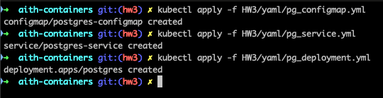

# ЛР 3. Kubernetes

1. Установить kubectl

- Ссылка на [kubectl](https://kubernetes.io/docs/tasks/tools/)


2. Установить minikube

- Ссылка на [minikube](https://minikube.sigs.k8s.io/docs/start)


3. Описываем yaml-файлы

Добавлены файлы `pg_configmap.yml`, `pg_deployment.yml`, `pg_service.yml`

Значение пароля изменено с `any_password_u_want` на `my_super_secret_password`.

4. Прогоняем манифесты (создаем объекты в кластере) с помощью команды kubectl




> [!NOTE]  
> Вопрос: важен ли порядок выполнения этих манифестов? Почему?
> Ответ: да, важен. Ввиду того, что deployment'у postgres'а необходимо получить данные `POSTGRES_DB`, `POSTGRES_USER`, `POSTGRES_PASSWORD` для работы, configmap создается первым. Если сначала создать deployment, то в `kubectl describe deploy/postgres` можно будет увидеть, что kubernetes не может получить данные из conigmap. Создавать сначала deployment или service (если мы рассматриваем учебный пример) принципиальной разницы нет, но если сначала создать service, а затем deployment, запросы будут падать с ошибкой о том, что эндпоинтов у него нет.


5. Создаем nextcloud

- `kubectl apply -f yaml/nextcloud.yml`


Проверим, что все работает:
- `kubectl logs -f nextcloud-5d48b8556b-dxzsv`


6. Попробуем подключиться к nextcloud "извне"

Перенаправим траффик через ноду:
- `kubectl expose deployment nextcloud --type=NodePort --port=80`


Затунеллируем трафик между нодой minikube и созданным сервисом:
- `minikube service nextcloud`


> [!NOTE]  
> Вопрос: что (и почему) произойдет, если отскейлить количество реплик postgres-deployment в 0, затем обратно в 1, после чего попробовать снова зайти на Nextcloud?
> Ответ: под nextcloud технически продолжит работать, но все запросы будут неудачными (доказательства ниже). Это произошло из-за того, что мы фактически уничтожили базу данных, к которой первоначально подключился nextcloud и создал определенные объекты. Из-за того что сам под nextcloud мы не перезапускали, он продолжает считать, что объекты в базе данных созданы, в то время как при пересоздании реплики postgres все было уничтожено.


7. Для постгреса перенести `POSTGRES_USER` и `POSTGRES_PASSWORD` из конфигмапы в секреты

Создадим `yaml/pg_secret.yml` и перенесем в него `POSTGRES_USER` и `POSTGRES_PASSWORD` из `postgres-configmap`

```yaml
apiVersion: v1
kind: Secret
metadata:
  name: postgres-secret
  labels:
    app: postgres
type: Opaque
stringData:
  POSTGRES_USER: "postgres"
  POSTGRES_PASSWORD: "my_super_secret_password"
```

Добавим еще одну секцию в блок envFrom в `yaml/pg_deployment.yml`

```yaml
- secretRef:
    name: postgres-secret
```

Применим все получившиеся конфигурации postgres:
- `kubectl apply -f yaml/pg_configmap.yml`
- `kubectl apply -f yaml/pg_secret.yml `
- `kubectl apply -f yaml/pg_service.yml` 
- `kubectl apply -f yaml/pg_deployment.yml`


8. Для некстклауда перенести его переменные ( `NEXTCLOUD_UPDATE` , `ALLOW_EMPTY_PASSWORD` и проч.) из деплоймента в конфигмапу

Добавим в `yaml/nextcloyd.yml` секцию, в которой будет описана configmap

```yaml
apiVersion: v1
kind: ConfigMap
metadata:
  name: nextcloud-configmap
  labels:
    app: nextcloud
data:
  NEXTCLOUD_UPDATE: '1'
  ALLOW_EMPTY_PASSWORD: 'yes'
  POSTGRES_HOST: "postgres-service"
  NEXTCLOUD_TRUSTED_DOMAINS: "127.0.0.1"
  NEXTCLOUD_ADMIN_USER: "any_name_you_want"
```

Добавим секцию envFrom в deployment `yaml/nextcloyd.yml`, и удалим захардкоженные переменные ( `NEXTCLOUD_UPDATE` , `ALLOW_EMPTY_PASSWORD` и проч.)

```yaml
envFrom:
  - configMapRef:
      name: nextcloud-configmap
```

Помимо этого, заменим `configMapKeyRef` для `POSTGRES_USER` и `POSTGRES_PASSWORD` на `secretKeyRef` и `name: postgres-secret`, так как мы вынесли это в отдельный секрет `postgres-secret`.

1. Для некстклауда добавить Liveness и Readiness пробы

Добавим секции `livenessProbe` и `readinessProbe` в `yaml/nextcloyd.yml`

```yaml
livenessProbe:
  tcpSocket: # На какой TCP сокет отправляем liveness пробу
    port: 80
  initialDelaySeconds: 15 # Подождать 15 секунд с момента запуска пода
  periodSeconds: 10 # Каждые 10 секунд
  timeoutSeconds: 10 # Подождать 10 секунд после проваленной пробы
  failureThreshold: 3 # Количество проваленных проб после которых под умирает
  successThreshold: 1 # Количество успешных проб после которых под считается живым
readinessProbe:
  httpGet: # На какой TCP сокет отправляем readiness пробу
    port: 80
  initialDelaySeconds: 15 # Подождать 15 секунд с момента запуска пода
  periodSeconds: 10 # Каждые 10 секунд
  timeoutSeconds: 10 # Подождать 10 секунд после проваленной пробы
  failureThreshold: 3 # Количество проваленных проб после которых под умирает
  successThreshold: 1 # Количество успешных проб после которых под считается живым
```

Запустим nextcloud в новой конфигурации (перенос переменых в configmap + добавлены пробы):
- `kubectl apply -f yaml/nextcloud.yml`


