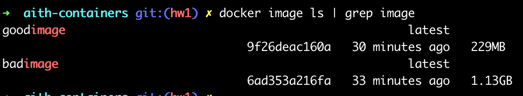

# Lab 1
Содержимое для плохого и хорошего файлоф можно посмотреть в BadDockerfile и GoodDockerfile соответственно.
## Отличия и исправления
1. **Копирование всех файлов**: В `BadDockerfile` мы копируем все файлы проекта в контейнер, включая `.git`, файлы настроек, временные файлы и прочее, что может увеличить размер контейнера. В `GoodDockerfile` только файлы необходимые непосредственно для работы проекта
2. **Кеширование слоев**: В `BadDockerfile` кеширование слоев не достаточно оптимальное: копируются все файлы, затем устанавливаются зависимости. При отсутствии разделения на слои, Docker не сможет эффективно использовать кеш для установки зависимостей. В `GoodDockerfile` сначала устанавливаем зависимости, и только после этого копируем остальной код приложения.
3. **Использование легковесного образа**: В `BadDockerfile` испольузется полный образ python, в то время как в `GoodDockerfile` slim версия, которой также достаточно для работы приложения + она занимает гораздо меньше места.
4. **Оптимизация работы с poetry**: В `BadDockerfile` отсутствуют какие-либо флаги при работе с poetry, что приводит к увеличению образа, а также возможномоу попаданию нежелательный зависимостей в продакшн билд. В `GoodDockerfile` используем флаг `--no-cache-dir` при установке poetry, что предотвращает сохранение ненужного кеша. При установке зависимостей используем `--no-root --no-dev`, что позволяет не устанавливать зависимости, которые нужны только при разработке (в нашем случае таких не объявлено, но закладываем на будущее), а также не устанавливаем сам проект как зависимость.
Используя все практики удалось сократить размер образа более чем на 80%

## Плохие практики по использованию контейнера
1. Поскольку у нас веб приложение, то ему нужно объявлять порты. Плохой практикой будет не указание явно нужных портов или открытие всех, в то время как хорошо будет делать явное указание, например `-p 8080:80`
2. Отсутствие ограничений по ресурсам контейнера, что можем привезти к тому, что при росте нагрузке контейнер будет потреблять все доступные ресурсы машины. Необходимо отслеживать потребление, а также ввести ограничения, например 
## Когда не стоит использовать контейнеры
1. При разработке небольших локальных проектов, которые не планируется где-то деплоить и в принципе распространять.
2. Если необходима высокая производительность, которую контейнеры не могут обеспечить
