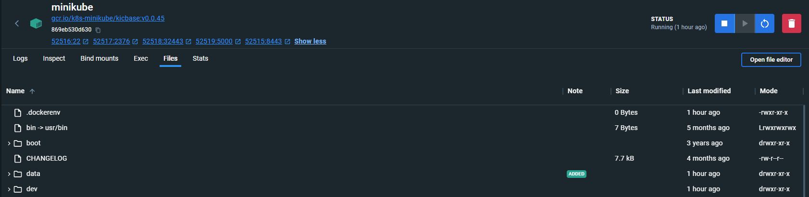
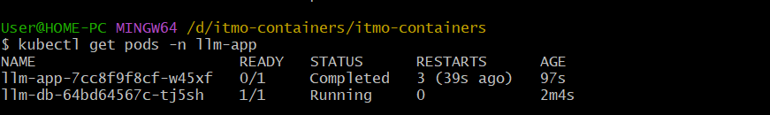
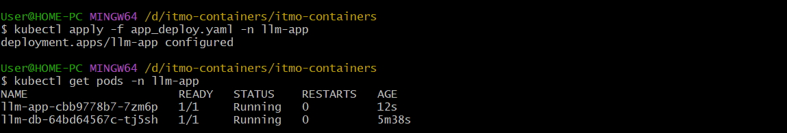

# Задание: Развернуть свой собственный сервис в Kubernetes
### building Custom Images 


```bash

docker build -t llm-init ./init/

docker build -t llm-app ./llm_app/
```


### Tакже для Language-Model 
```bash

docker build -t llm-app ./llm_app/
```


### Images for the models 

```bash
# Image
cd init
docker build -t llm-init .

# Image
cd ../llm_app
docker build -t llm-app .
```


### запускаем minikube
```bash
minikube start
```


### Container   Результаты



##  создаем namespace
```bash
kubectl create namespace llm-app

```
## Applying all the manifestations to the namespace

```bash
kubectl apply -f secrets.yaml -n llm-app


kubectl apply -f volume.yaml -n llm-app


kubectl apply -f db_deploy.yaml -n llm-app


kubectl apply -f db_service.yaml -n llm-app


kubectl apply -f app_deploy.yaml -n llm-app


kubectl apply -f app_service.yaml -n llm-app


minikube service llm-app -n llm-app
```
## Проверяем If all pods are working 
```bash

$ kubectl get pods -n llm-app
```

## ALL ports should be infinity 
```bash
 ports:
        - containerPort: 1337
        command: ["sleep", "infinity"] 
```

