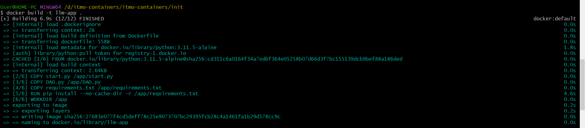
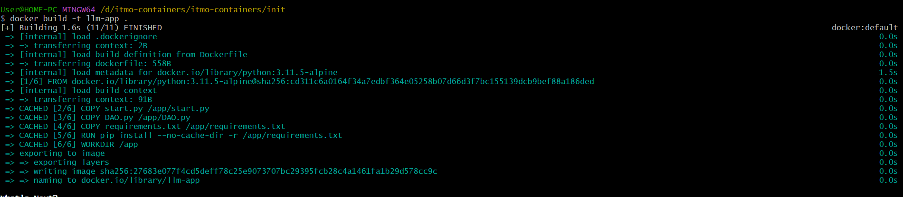
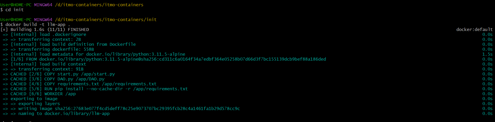
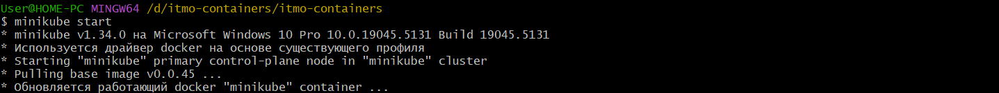
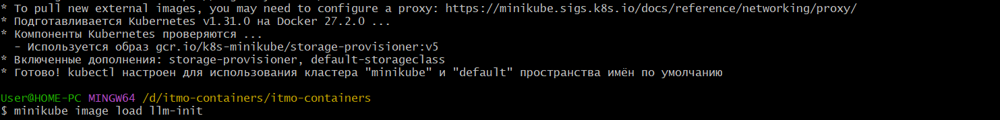

# Задание: Развернуть свой собственный сервис в Kubernetes
### building Custom Images 


```bash

docker build -t llm-init ./init/

docker build -t llm-app ./llm_app/
```


### Tакже для Language-Model 
```bash

docker build -t llm-app ./llm_app/
```


### Images for the models 

```bash
# Image
cd init
docker build -t llm-init .

# Image
cd ../llm_app
docker build -t llm-app .
```


### запускаем minikube
```bash
minikube start.
```


